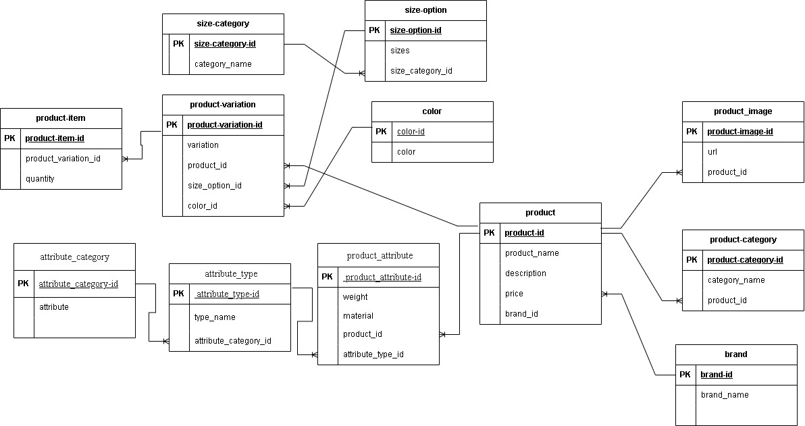

# Overview  
This project involves the design and implementation of a MySQL relational database for a fictional. It simulates a real-world e-commerce syatem where people can order products online. The goal is to create an efficient, normalized database schema and apply SQL programming skills including table creation, querying, and user access management.  

## Tools and Technologies  
MySQL: Relational Database Management System (RDBMS)  
Draw.io (diagrams.net): For visualizing the Entity-Relationship Diagram (ERD)  
GitHub: For version control and collaboration  

## Prerequisites  
To successfully use or build upon this project, you should be familiar with:  
SQL Basics (DDL, DML)  
Creating tables and defining relationships  
Managing users and privileges in MySQL  
Normalization and relational database design  

## How to Test the Database  
Import the SQL script (schema.sql) into your MySQL server.  
Run SELECT queries to test table creation and relationships.  
Insert sample data using INSERT INTO statements.  
Create views or reports to analyze customer orders or popular books.  
 
 ERD Entitty Relationship Diagram   
  

## Collaborators  
Mwangi Wambugu  
Zumrati Yusuf  
Raphael Ochieng'  
Mercy Njoroge   
Velile  Mifi  
Neo Mokoele  
Aileen Nyathi  
